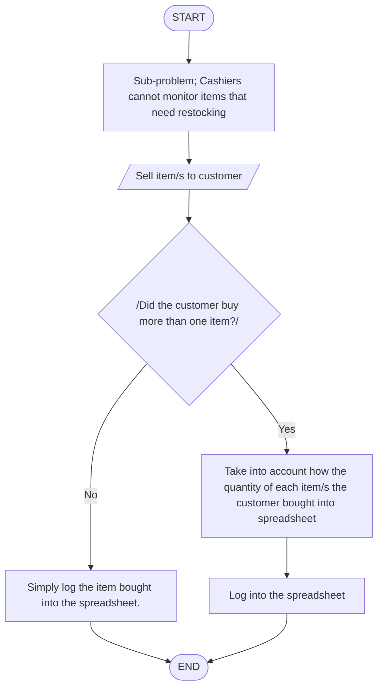

## 9-Samat  
## 16,17,18 TRIA, ABLOLA, ACOSTA 
08/14/26  
Step 1: Identify the main problem
Main problem: Students and teachers of Pisay CLC are held up in queues during their lunch break.  
---
Possible subproblems:  
1. Not all students are quick to decide on what to order.  
2. The cashiers have to manually calculate the total, and change of each customer.  
3. The cashiers have no way to monitor on which food items need restocking.  
---
| Sub-problem | CT Skills | Example Solution |
| --- | --- | --- |
| Some students are indecisive on what to eat. | Pattern Recognition | Present a menu for students to decide what to eat beforehand. |
| Cashiers have to manually calculate orders and change | Decomposition | Provide calculators to the cashiers; lessening the burden from them manually subtracting or adding orders to just inputting numbers into a calculator. |
| Cashiers cannot monitor items that need restocking | Algorithm Design | Before the transaction finalizes, cashiers first have to log what item a customer buys into a spreadsheet. Therefore, in some way, cashiers can keep track of which items maybe running low on stock. |

